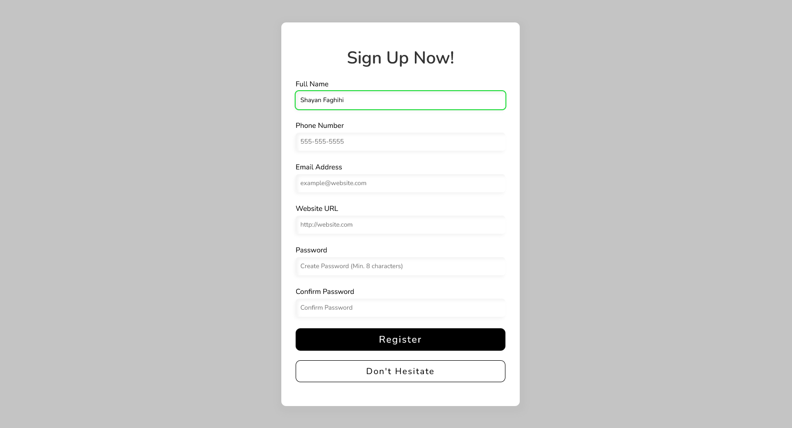

# Form Validation using Pure JavaScript

This is a self challenge for how we can validate form inputs using pure JavaScript

## Table of contents

- [Overview](#overview)
  - [Screenshot](#screenshot)
  - [Links](#links)
- [My process](#my-process)
  - [Built with](#built-with)
  - [What I learned](#what-i-learned)
  - [Continued development](#continued-development)
  - [Useful resources](#useful-resources)
- [Author](#author)
- [Acknowledgments](#acknowledgments)

## Overview
A simple registration form with the ability to validate the inputs on the front side

### Screenshot

### Links

- Solution URL: https://github.com/ShayanFaghihi/form-validator
- Live Site URL: https://shayanfaghihi.github.io/form-validator/

## My process
Everything started by layout being designed in HTML5 and CSS3. The form is completely responsive. For validating the forms I have used RegEX rules for matching with valid formats of each input

### Built with

- Semantic HTML5 markup
- CSS custom properties
- Flexbox
- Mobile-first workflow
- Pure JavaScript
- RegEX filtering

## Author

- Website - [Shayan Faghihi](https://shayan-faghihi.ir)
- Frontend Mentor - [@ShayanFaghihi](https://www.frontendmentor.io/profile/ShayanFaghihi)
- Twitter - [@Shayan_Faghihi](https://twitter.com/Shayan_Faghihi)
